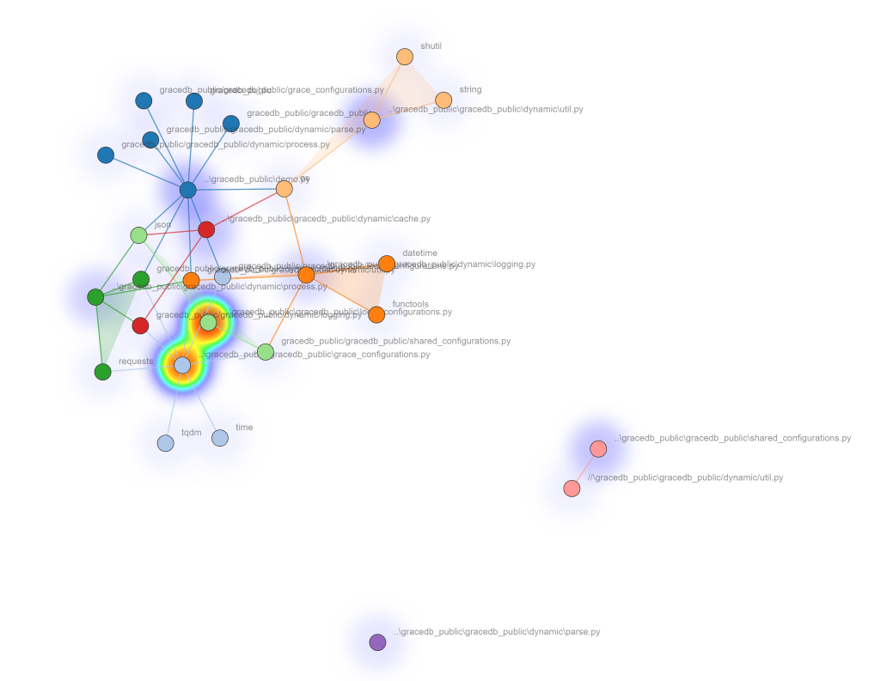

# GraceDB-public

## Introduction

The GraceDB-public package uses the official GraceDB API to communicate with the public portion of the database. The GraceDB-public package is part of the Gravitational Wave SkyMap Stellarium plug-in project. It is used in collecting the list of GraceDB ‘Superevents’ and skymaps attached to them.

## Flowchart

## Structure

- GraceDB-Public
    - gracedb_public
        
        shared_configurations.py
        
        grace_configurations.py
        
        local_configurations.py
        
        - dynamic
            
            cache.py
            
            util.py
            
            parse.py
            
            log.py
            
            process.py
            
    - cached_events
        
        local_superevents.json
        
    - ~~files~~
    - ~~\log~~
    - ~~\test~~

    

